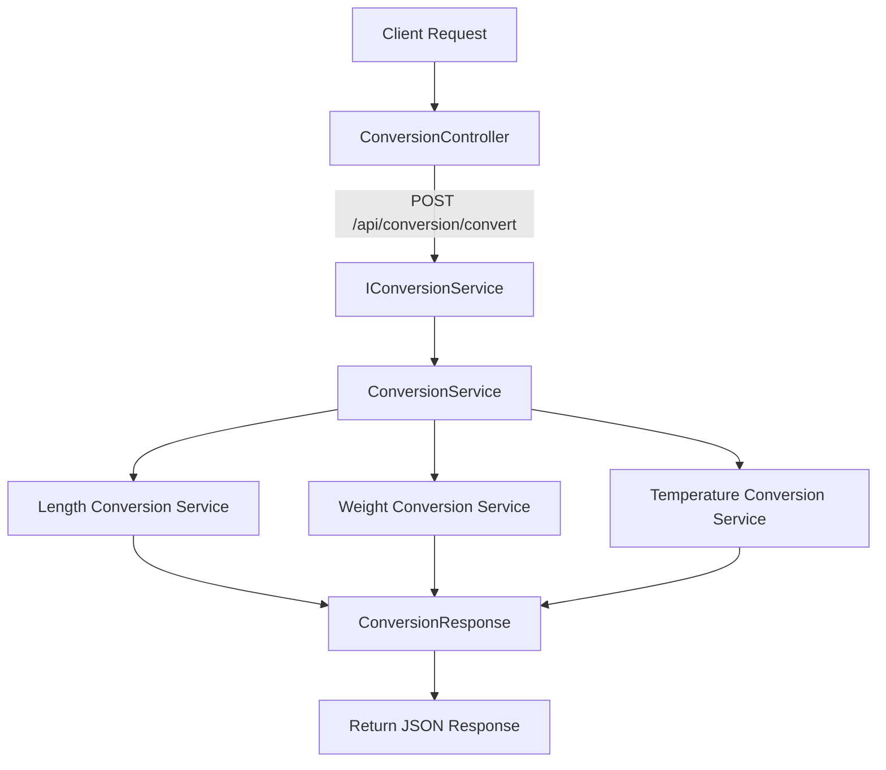

# Measurement Units Converter

A comprehensive .NET 8 ASP.NET Core Web API for converting between different measurement units including length, temperature, and weight.

## Overview

Measurement Units Converter is a RESTful API built with .NET 8 and ASP.NET Core that provides conversion services between commonly used measurement units. The solution follows clean architecture principles with service interfaces, implementations, and controllers for maintainable and scalable code.

## Architecture Diagram

## Features

- **Length Conversion**: Convert between meters and feet
- **Temperature Conversion**: Convert between Celsius and Fahrenheit
- **Weight Conversion**: Convert between kilograms and pounds
- **Rate Limiting**: Built-in rate limiting to protect API endpoints
- **Swagger/OpenAPI**: Interactive API documentation and testing interface
- **Dependency Injection**: Loosely coupled, testable architecture

## Getting Started

### Prerequisites

- .NET 8 SDK or later
- Visual Studio 2022 (recommended)

### Installation

1. Clone the repository:
2. Restore dependencies:
3. Build the solution:
4. Run the application:

## API Endpoints

All endpoints are prefixed with `/api/conversion`

### Convert Unit

**Endpoint**: `POST /api/conversion/convert`

**Description**: Converts a value from one unit to another based on the specified category.

**Request Body**:
{ "value": 10, "fromUnit": "meter", "toUnit": "foot", "category": "length" }

**Response** (Status 200):
{ "convertedValue": 32.8084, "message": "10 meter = 32.8084 foot" }

**Error Response** (Status 400):
{ "error": "Invalid request." }

### Supported Conversions

#### Length Conversion
- **Category**: `length`
- **Supported Units**: `meter`, `foot`
- **Conversion**: 1 meter = 3.28084 feet

**Example Request**:
curl -X POST "https://localhost:7000/api/conversion/convert" 
-H "Content-Type: application/json" 
-d '{"value": 5, "fromUnit": "meter", "toUnit": "foot", "category": "length"}'

**Example Response**:
{ "convertedValue": 16.4042, "message": "5 meter = 16.4042 foot" }

#### Temperature Conversion
- **Category**: `temperature`
- **Supported Units**: `celsius`, `fahrenheit`
- **Conversion**: °F = (°C × 9/5) + 32

**Example Request**:
curl -X POST "https://localhost:7000/api/conversion/convert" 
-H "Content-Type: application/json" 
-d '{"value": 25, "fromUnit": "celsius", "toUnit": "fahrenheit", "category": "temperature"}'

**Example Response**:
{ "convertedValue": 77, "message": "25 celsius = 77 fahrenheit" }

#### Weight Conversion
- **Category**: `weight`
- **Supported Units**: `kilogram`, `pound`
- **Conversion**: 1 kilogram = 2.20462 pounds

**Example Request**:
curl -X POST "https://localhost:7000/api/conversion/convert" 
-H "Content-Type: application/json" 
-d '{"value": 75, "fromUnit": "kilogram", "toUnit": "pound", "category": "weight"}'

**Example Response**:
{ "convertedValue": 165.3465, "message": "75 kilogram = 165.3465 pound" }

## Rate Limiting

The API implements rate limiting with the following default policy:
- **Limit**: 5 requests
- **Window**: 10 seconds
- **Queue Limit**: 2 queued requests

## API Documentation

Interactive Swagger/OpenAPI documentation is available at:
- **Development**: `https://localhost:7000/swagger/index.html`
- **Production**: `https://yourdomain.com/swagger/index.html`

Use the Swagger UI to explore and test all available endpoints interactively.

## Technologies

- **.NET 8**: Latest long-term support framework
- **ASP.NET Core**: Web API framework
- **Swagger/OpenAPI**: API documentation
- **Rate Limiting**: Built-in middleware for request throttling

## Contributing

Contributions are welcome! Please feel free to submit a Pull Request.

## License

This project is open source and available under the MIT License.

## Contact

For more information, visit the [GitHub repository](https://github.com/nareshce25/MUnitsConverter).

   
